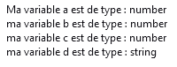

# <div align="center">  Cours de JavaScript  </div>  
# <div align="center">   </div>
## Introduction au JavaScript  
**JavaScript** est un langage de programmation de scripts principalement employé dans les pages web interactives et à ce titre est une partie essentielle des applications web. Avec les langages HTML et CSS, JavaScript est au cœur des langages utilisés par les développeurs web. Une grande majorité des sites web l'utilisent, et la majorité des navigateurs web disposent d'un moteur JavaScript pour l'interpréter. 
## Qu’est-ce qu’une variable ?

Une variable est un conteneur servant à stocker des informations de manière temporaire, comme une chaine de caractères (un texte) ou un nombre par exemple.

Le propre d’une variable est de pouvoir varier, c’est-à-dire de pouvoir stocker différentes valeurs au fil du temps et c’est cette particularité qui les rend si utiles.
## Les règles de déclaration des variables en JavaScript

Concernant le nom de nos variables, nous avons une grande liberté dans le nommage de celles-ci mais il y a quand même quelques règles à respecter :

* Le nom d’une variable doit obligatoirement commencer par une lettre ou un underscore (_) et ne doit pas commencer par un chiffre ;
* Le nom d’une variable ne doit contenir que des lettres, des chiffres et des underscores mais pas de caractères spéciaux ;
* Le nom d’une variable ne doit pas contenir d’espace.
* Le nom d'un variable ne doit pas être un mot réservé.

```
var maChaine = new String("exemple");
```
typeof maCHaine renverra un type object.

```
var a = 42; 
var b = 4.2;
var c = -42;
var d = "42":
alert( "Ma variable a est de type : " + typeof a + "\nma variable b est de type : " + typeof b + "\nma variable c est de type : " + typeof c + "\nma variable d est de type : " + typeof d);
```


```
var n = null;
var u ;
var nn = NaN;
alert( "Ma variable n est de type : " + typeof n + 
"\nma variable u est de type : " + typeof u + 
"\nma variable nn est de type : " + typeof nn );
```

